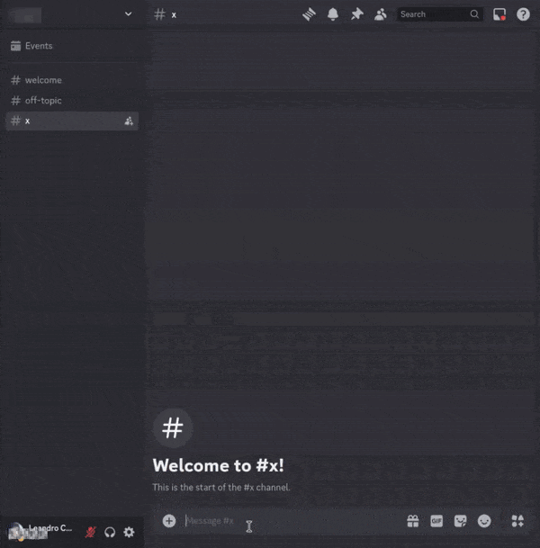

# di𝕏cord

## Q&A

### What?



### Why?

For fun. (and because 𝕏 was banned in Brazil)

### Where?

[Click here](https://discord.com/oauth2/authorize?client_id=1197282179546349590&permissions=8&integration_type=0&scope=bot) to add the bot to your Discord server.

## Developing

### Prerequisites

- [Docker](https://docs.docker.com/get-docker/)
- [Docker Compose](https://docs.docker.com/compose/)
- [Bot account](https://docs.disnake.dev/en/stable/discord.html)

### Installing

1. Clone the repository using [Git](https://git-scm.com/).
```sh
git clone git@github.com:leandcesar/diXcord.git
```
2. Navigate to the directory.
```sh
cd diXcord
```

### Running

3. Ensure you fill in the necessary environment variables in the `.env` file.
4. Build the Docker service for the application.
```sh
make build
```
5. Start the application and check if everything is running correctly.
```sh
make up
```

### Cleaning up

6. Stop and remove Docker containers and networks.
```sh
make down
```
7. Remove temporary files.
```sh
make clean
```
